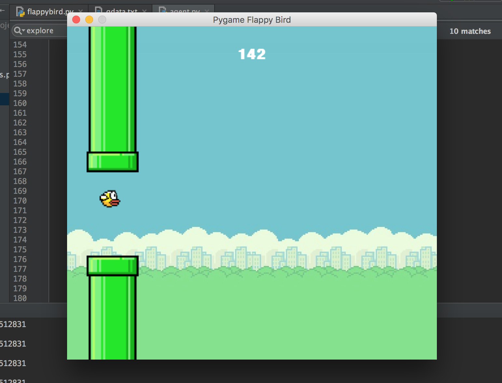

# Flappy Bird - QLearning
* @author Anthony (Tony) Poerio  
* @email adp59@pitt.edu  

## Overview
This project contains the implementation of a Q-Learning Artificial Intelligence for learning to play the popular video game **Flappy Bird**.

The project folder is divided into two sections:
* The original game (unmodified, and made by @TimoWilken)
* My modified game which contains an AI-Agent made to learn and play Flappy Bird automatically

### Source Code
The source code for my AI contained in the folder named 'updated_game'

### Running the program
To use my smart bird, simply take the following steps:
* cd into a directory containing my source code
* Ensure that this directory includes the file named ‘qdata.txt’ 
* Run the command:  
`python flappybird.py "qdata.txt"`
* Watch Flappy crush it.  (the game will run 10x)

### Results
Based on the current qdata.txt file, I have seen Flappy get well over 100 pipes. 

### Report
The report for this section is found starting on the **first page** of the document located at:
`/ADP59-CS1571-HW03-REPORT.pdf`

### Version
This source code is written using python version 2.7.8

--

## Prerequisities
This project depends upon Python v. 2.7.8

I am also using the **itertools** python library

You must also have the config files you intend to read from in the same directory as the source code

## Built With
* Python v. 2.7.8
* PyCharm

## Acknowledgments
* Project done for Rebecca Hwa's Artificial Intelligence class at the University of Pittsburgh
* Implementation ideas from: http://sarvagyavaish.github.io/FlappyBirdRL/ 
* Also consulted: http://mnemstudio.org/path-finding-q-learning-tutorial.htm 
